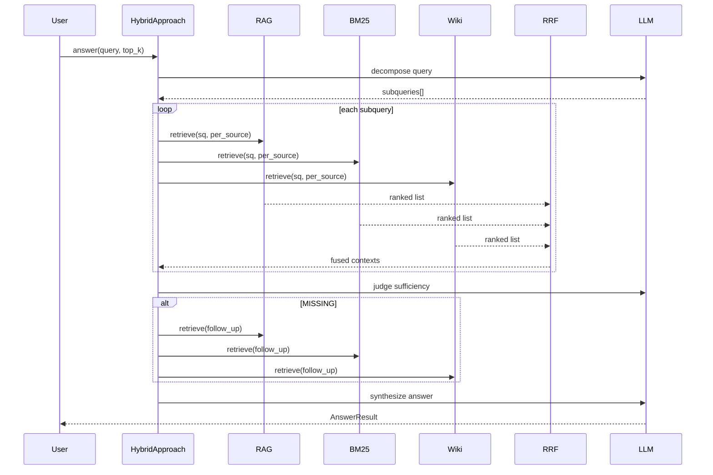
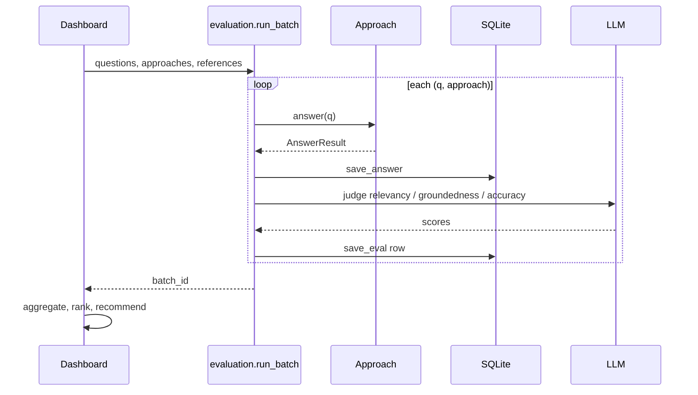

# RAG Approaches Evaluation Lab — Technical Specification

End-to-end technical reference for the **RAG Approaches Evaluation Lab**: architecture, data models, algorithms, persistence, LLM integration, evaluation methodology, UI behavior, configuration, and operational notes.

**Related documents:** [README.md](README.md) (user guide + replication prompt) · [.env.example](.env.example) (configuration template)

---

## 1. Purpose and scope

### 1.1 Problem statement

Teams choosing a retrieval strategy for document Q&A typically compare options informally. This application provides a **controlled, repeatable benchmark** on a fixed corpus:

- Same documents, same questions, same LLM for answer synthesis and judging.
- Observable metrics: retrieval confidence, latency (build / search / answer), agent steps, index size, and LLM-judged quality.
- Five implementations sharing a common interface so differences isolate **retrieval and orchestration**, not UI or storage.

### 1.2 Non-goals

- Multi-user authentication or hosted SaaS deployment.
- Production-grade ingestion pipelines (OCR, PII redaction, incremental updates).
- Fine-tuning embedding models or re-ranking models beyond RRF.
- Guaranteed factual correctness (judges are LLM-based and relative).

### 1.3 Runtime profile

| Aspect | Choice |
|--------|--------|
| Deployment | Single-machine, single-user |
| UI | Streamlit multi-page app |
| Embeddings | Local CPU/GPU via `sentence-transformers` |
| Vector DB | ChromaDB persistent client on disk |
| Keyword index | Pickled `BM25Okapi` + parallel text/metadata lists |
| Wiki index | Pickled section list + embedding matrix |
| Metadata / cache | SQLite |
| LLM | Pluggable: OpenAI-compatible HTTP (primary for portability) or optional vendor SDK |

---

## 2. System architecture

### 2.1 Layered view

```
┌─────────────────────────────────────────────────────────────────┐
│  Streamlit UI (app.py, pages/*.py)                              │
├─────────────────────────────────────────────────────────────────┤
│  Orchestration: pipeline.ingest_and_build, evaluation.run_batch │
├──────────────┬──────────────┬──────────────┬──────────────────┤
│  Approaches  │  cursor_llm  │  embeddings  │  retrieval_fusion│
│  (5 x ABC)   │  + fallback  │  (local)     │  (RRF)           │
├──────────────┴──────────────┴──────────────┴──────────────────┤
│  ingest.py          store.py (SQLite + Chroma helpers)          │
├─────────────────────────────────────────────────────────────────┤
│  data/uploads  data/chroma  data/indexes/*.pkl  raglab.sqlite   │
└─────────────────────────────────────────────────────────────────┘
```

### 2.2 End-to-end data flow

#### Ingest path

```
User uploads files
    → save_upload() writes bytes to data/uploads/{filename}
    → load_corpus(paths) → List[Page]
    → chunk_pages(pages) → List[Chunk]
    → For each selected approach key:
          approach.build(pages, chunks) → BuildResult
          store.save_build(BuildResult)
```

#### Query path (single approach)

```
User question + top_k
    → approach.answer(query, top_k)
         → retrieve(query, top_k) → List[RetrievedContext], search_time
         → build_answer_prompt(query, contexts)
         → llm.complete(prompt, system=ANSWER_SYSTEM) → answer, answer_time
    → store.save_answer(AnswerResult)
    → UI displays answer + contexts + metrics
```

#### Batch evaluation path

```
Golden set (SQLite golden table)
    → For each (question, approach):
          approach.answer() → score_answer() → store.save_eval(row)
    → aggregate(rows) → rank() → recommendation markdown
```

### 2.3 Approach dependency graph

```
                    ┌─────────────┐
                    │   ingest    │
                    │ pages/chunks│
                    └──────┬──────┘
           ┌───────────────┼───────────────┐
           ▼               ▼               ▼
      ┌────────┐    ┌──────────┐   ┌──────────┐
      │  RAG   │    │ Page Idx │   │ LLM Wiki │
      │ Chroma │    │  BM25    │   │ sections │
      └───┬────┘    └────┬─────┘   └────┬─────┘
          │              │              │
          ▼              │              │
   ┌─────────────┐       │              │
   │ Agentic RAG │       │              │
   │ (reuses     │       │              │
   │  Chroma)    │       │              │
   └─────────────┘       │              │
                         └──────┬───────┘
                                ▼
                         ┌─────────────┐
                         │   Hybrid    │
                         │ RRF(vector, │
                         │ BM25, wiki) │
                         └─────────────┘
```

---

## 3. Core data models

### 3.1 Ingest types (`raglab/ingest.py`)

```python
@dataclass
class Page:
    source: str      # filename, e.g. "AML-2025-0013.pdf"
    page_no: int     # 1-based; always 1 for non-paginated formats
    text: str

@dataclass
class Chunk:
    id: str          # sha1(source:page_no:ordinal)[:16]
    source: str
    page_no: int
    ordinal: int     # global sequence in corpus
    text: str
    metadata: dict   # {"source", "page_no"}
```

**Chunking algorithm:**

- Parameters: `chunk_size=900`, `chunk_overlap=150` → step = 750 characters.
- Applied per `Page` independently (boundaries do not cross PDF pages).
- Whitespace normalized: collapse runs of blank lines to single blank line.
- Empty pages skipped.

**Supported extensions:** `.txt`, `.md`, `.markdown`, `.pdf`, `.docx`

| Format | Loader behavior |
|--------|-----------------|
| PDF | `pypdf.PdfReader`, one `Page` per PDF page with extractable text |
| TXT/MD | Single `Page`, `page_no=1` |
| DOCX | `python-docx`, paragraphs joined, single `Page` |

**`corpus_text(pages, max_chars=None)`:** Joins pages as `### {source} (page {n})\n{text}` separated by blank lines. If `max_chars` set, hard-truncates the joined string (used for wiki LLM batches).

### 3.2 Runtime result types (`raglab/store.py`)

```python
@dataclass
class RetrievedContext:
    text: str
    score: float       # 0..1 after normalization per retriever
    source: str = ""
    page_no: int = 0

@dataclass
class BuildResult:
    approach: str
    build_time: float  # seconds, wall clock
    num_chunks: int    # semantic meaning varies by approach
    num_docs: int
    index_size: int    # bytes on disk (approximate)
    detail: dict       # approach-specific metadata

@dataclass
class AnswerResult:
    approach: str
    query: str
    answer: str
    contexts: List[RetrievedContext]
    search_time: float
    answer_time: float
    n_steps: int       # LLM calls in agentic/hybrid answer path
    confidence: float  # mean retrieval score
    error: Optional[str]

    @property
    def total_time(self) -> float:
        return search_time + answer_time
```

### 3.3 Approach registry

| Key | Class | `num_chunks` meaning |
|-----|-------|----------------------|
| `rag` | `RagApproach` | Chroma document count |
| `agentic_rag` | `AgenticRagApproach` | Same as RAG (shared collection) |
| `llm_wiki` | `LlmWikiApproach` | Wiki section count |
| `page_indexing` | `PageIndexingApproach` | BM25 corpus size (chunks) |
| `hybrid` | `HybridApproach` | RAG chunk count (primary index) |

---

## 4. Persistence

### 4.1 SQLite schema (`data/raglab.sqlite`)

#### `builds`

| Column | Type | Description |
|--------|------|-------------|
| `approach` | TEXT PK | Approach key |
| `build_time` | REAL | Seconds |
| `num_chunks` | INTEGER | Indexed units |
| `num_docs` | INTEGER | Distinct source files |
| `index_size` | INTEGER | Bytes |
| `detail` | TEXT | JSON object |
| `created_at` | REAL | Unix timestamp |

Upsert on conflict (`ON CONFLICT DO UPDATE`).

#### `answers`

| Column | Type | Description |
|--------|------|-------------|
| `qhash` | TEXT PK | `sha1(f"{approach}::{query.lower()}")[:20]` |
| `approach` | TEXT | |
| `query` | TEXT | |
| `answer` | TEXT | |
| `contexts` | TEXT | JSON array of `RetrievedContext` dicts |
| `search_time`, `answer_time` | REAL | |
| `n_steps` | INTEGER | |
| `confidence` | REAL | |
| `error` | TEXT | Nullable |
| `created_at` | REAL | |

Used for: home-page “last query” per approach; optional cache semantics on upsert.

#### `evals`

| Column | Type | Description |
|--------|------|-------------|
| `id` | INTEGER PK AUTOINCREMENT | |
| `batch_id` | TEXT | e.g. `batch-1717234567` |
| `approach`, `query`, `answer` | TEXT | |
| `relevancy`, `groundedness`, `accuracy` | REAL | 0–100 or NULL |
| `confidence` | REAL | 0–1 |
| `search_time`, `answer_time`, `total_time` | REAL | |
| `n_steps` | INTEGER | |
| `build_time`, `index_size` | REAL / INTEGER | Snapshot from `builds` |
| `overall` | REAL | Quality composite |
| `created_at` | REAL | |

Migration: `accuracy` column added via `ALTER TABLE` if missing (legacy DBs).

#### `golden`

| Column | Type | Description |
|--------|------|-------------|
| `id` | INTEGER PK | |
| `question` | TEXT | |
| `reference` | TEXT | Optional reference answer |
| `created_at` | REAL | |

### 4.2 Chroma vector store

- **Path:** `data/chroma/`
- **Client:** `chromadb.PersistentClient`
- **Collection:** `rag_chunks` (constant `CHROMA_COLLECTION` in `store.py`)
- **Space:** cosine (`metadata={"hnsw:space": "cosine"}`)
- **Rebuild:** `reset_chroma()` deletes collection before RAG build (full rebuild, not incremental).

**Stored per chunk:**

```python
ids=[chunk.id]
documents=[chunk.text]
embeddings=[vector]  # L2-normalized, dim = embedder.dim
metadatas=[{"source": chunk.source, "page_no": chunk.page_no}]
```

**Query:**

```python
col.query(
    query_embeddings=[qvec],
    n_results=top_k,
    include=["documents", "metadatas", "distances"],
)
# score = 1.0 - distance  (cosine distance → similarity)
```

### 4.3 BM25 index (`data/indexes/bm25_index.pkl`)

Pickle payload:

```python
{
    "bm25": BM25Okapi,      # rank_bm25
    "texts": List[str],     # parallel to chunks at build time
    "metas": List[dict],    # {"source", "page_no"}
}
```

**Tokenization:** `re.findall(r"[a-z0-9]+", text.lower())`

**Scoring:** `bm25.get_scores(query_tokens)` → sort descending → take `top_k`.

**Confidence mapping:** `sigmoid(score) = 1 / (1 + exp(-score))` because raw BM25 scores can be ≤ 0 on small corpora.

### 4.4 Wiki index (`data/indexes/wiki_index.pkl`)

Pickle payload:

```python
{
    "sections": List[dict],   # {title, content, kind?}
    "embeddings": List[List[float]],  # numpy-compatible lists, L2-normalized
}
```

**Human preview:** `data/indexes/wiki.md` (truncated document previews + full summary sections).

---

## 5. Embeddings (`raglab/embeddings.py`)

| Property | Value |
|----------|-------|
| Default model | `BAAI/bge-small-en-v1.5` (env: `RAGLAB_EMBED_MODEL`) |
| Library | `sentence-transformers` |
| Loading | Lazy singleton `embedder` |
| Normalization | `normalize_embeddings=True` (cosine = dot product) |
| Batch | `encode()` on document lists; query = single-item encode |

**TLS:** `bootstrap.setup_tls()` runs before first HuggingFace download.

**Failure mode:** `EmbeddingDownloadError` with corporate-network guidance if `CERTIFICATE_VERIFY_FAILED`.

---

## 6. LLM integration (`raglab/cursor_llm.py`, `raglab/llm_fallback.py`)

### 6.1 Public API

```python
class LLMResult:
    text: str
    ok: bool
    elapsed: float
    error: Optional[str]

llm.complete(prompt: str, system: Optional[str] = None) -> LLMResult
llm.available() -> bool
llm.status_message() -> str
```

### 6.2 Backend selection

| Condition | Backend |
|-----------|---------|
| `RAGLAB_LLM_BACKEND=openai` | `llm_fallback.openai_complete` via httpx |
| `CURSOR_API_KEY` + runtime `local` | In-process vendor SDK `Agent.prompt` |
| `CURSOR_API_KEY` + runtime `subprocess` | Child process `python -m raglab.cursor_worker` |
| `CURSOR_API_KEY` + runtime `cloud` | REST cloud agents (`cursor_cloud.py`) + queue |
| Primary fails + `RAGLAB_LLM_FALLBACK=openai` | OpenAI HTTP |

### 6.3 OpenAI-compatible HTTP (`llm_fallback.py`)

```http
POST {OPENAI_BASE_URL}/chat/completions
Authorization: Bearer {OPENAI_API_KEY}
Content-Type: application/json

{
  "model": "{OPENAI_MODEL}",
  "messages": [
    {"role": "system", "content": "..."},   // optional
    {"role": "user", "content": "..."}
  ],
  "temperature": 0.2
}
```

Default model: `gpt-4o-mini`. Any OpenAI-compatible gateway works via `OPENAI_BASE_URL`.

### 6.4 Prompt assembly

When `system` is provided and backend is **not** pure OpenAI path with separate system role, prompts may be merged as:

```text
{system}

{prompt}
```

OpenAI backend passes `system` and `user` as distinct message roles.

### 6.5 Uses of the LLM in this application

| Call site | Purpose | Typical `n_steps` impact |
|-----------|---------|--------------------------|
| `base.Approach.answer` | Final synthesis | +1 |
| `agentic_rag` / `hybrid` | Query decomposition | +1 |
| `agentic_rag` / `hybrid` | Sufficiency judge (×1–2) | +1 each |
| `agentic_rag` / `hybrid` | Final synthesis | +1 |
| `llm_wiki.build` | Batched wiki summaries | Build-time only |
| `evaluation.judge_*` | Relevancy, groundedness, accuracy | Eval only |

### 6.6 Cloud queue (`raglab/cloud_queue.py`)

When `RAGLAB_CURSOR_RUNTIME=cloud`:

- Serializes agent starts with `RAGLAB_CLOUD_MAX_CONCURRENT` (default 1).
- `RAGLAB_CLOUD_GAP_SEC` sleep between starts.
- Retries on plan-limit errors: `RAGLAB_CLOUD_RETRY_ON_LIMIT`, `RAGLAB_CLOUD_RETRY_WAIT_SEC`.
- Dashboard batch eval registers a status callback for UI captions.

---

## 7. Retrieval approaches (algorithms)

### 7.1 Shared answer synthesis (`raglab/approaches/base.py`)

**System prompt (`ANSWER_SYSTEM`):**

```text
You are a precise question-answering assistant. Answer the user's question
using ONLY the provided context. If the context does not contain the answer,
say so plainly. Be concise and cite the source filenames you used.
```

**User prompt template (`build_answer_prompt`):**

```text
CONTEXT:
[1] {source} p.{page_no}
{chunk text}

[2] ...

QUESTION: {query}

ANSWER (use only the context above):
```

**Confidence:** arithmetic mean of `RetrievedContext.score` values, clamped to [0, 1].

---

### 7.2 RAG (`raglab/approaches/rag.py`)

**Build:**

1. `reset_chroma()` — delete existing collection.
2. For each batch of 128 chunks: `embed_documents` → `collection.add(...)`.
3. Record wall time, chunk count, Chroma directory size.

**Retrieve:**

1. `qvec = embed_query(query)`
2. Chroma `query(n_results=top_k)`
3. Map each hit to `RetrievedContext(score=1-distance, source, page_no)`

**Answer:** Default `Approach.answer` (retrieve + one LLM call). `n_steps` effectively 1 LLM call.

**Complexity:** O(N) embed at build; O(log N) approximate NN search at query (HNSW inside Chroma).

---

### 7.3 Agentic RAG (`raglab/approaches/agentic_rag.py`)

**Index:** Identical to RAG (shared `rag_chunks` collection). `build()` either rebuilds Chroma or reuses prior RAG build in the same ingest run.

**Answer algorithm:**

```
INPUT: query, top_k
1. subqueries ← LLM(DECOMPOSE_PROMPT + query)  // JSON array, 1-3 strings
2. collected ← []
3. FOR sq IN subqueries:
       ctxs ← RAG.retrieve(sq, top_k)
       collected.extend(ctxs)
4. collected ← dedupe by text[:120], keep highest score
5. followups ← 0
6. WHILE LLM available AND followups < max_followups (1):
       verdict ← LLM(JUDGE_PROMPT + build_answer_prompt(query, collected[:top_k*2]))
       IF verdict starts with "SUFFICIENT": BREAK
       follow_q ← parse "MISSING: ..."
       collected.extend(RAG.retrieve(follow_q, top_k))
       collected ← dedupe
       followups++
7. final_contexts ← collected[:top_k*2]
8. answer ← LLM(build_answer_prompt(query, final_contexts))
RETURN AnswerResult(n_steps = decompose + judges + final)
```

**Decompose prompt:**

```text
Break the user's question into 1-3 focused search queries that would help
retrieve supporting passages. Return ONLY a JSON array of strings.

QUESTION: {query}
```

**Judge prompt:**

```text
You are checking whether the CONTEXT is sufficient to fully answer the QUESTION.
If sufficient, reply exactly: SUFFICIENT
If not, reply: MISSING: <a single additional search query that would fill the gap>

{CONTEXT + QUESTION block}
```

---

### 7.4 LLM Wiki (`raglab/approaches/llm_wiki.py`)

**Design rationale:** A single 30k-character corpus slice (early design) excluded most documents in 100-PDF corpora. Current design guarantees **per-document coverage** plus optional thematic summaries.

**Build — Layer 1 (document sections, always):**

```
FOR each source file (sorted):
    text ← corpus_text(pages for source, max_chars=WIKI_DOC_CHARS)  // default 6000
    sections.append({
        title: "Document: {source}",
        content: text,
        kind: "document"
    })
```

**Build — Layer 2 (summary sections, optional):**

If `RAGLAB_WIKI_USE_LLM_SUMMARIES=1` and `llm.available()`:

```
batches ← pack whole documents into groups ≤ WIKI_BATCH_CHARS (default 12000)
FOR batch IN batches:
    material ← corpus_text(batch, max_chars=WIKI_BATCH_CHARS)
    response ← LLM(WIKI_BATCH_INSTRUCTION + material, system=WIKI_SYSTEM)
    sections.extend(parse JSON array [{title, content}])
    mark kind = "summary"
```

**Wiki LLM system prompt:**

```text
You are a technical writer building a knowledge wiki from AML investigation
reports. Preserve exact case IDs (e.g. AML-2025-0013), entity names,
upstream/downstream links, coordinators, and any CROSS-NETWORK BRIDGE notes.
```

**Wiki batch user instruction:**

```text
From the SOURCE MATERIAL below, write a structured wiki as a JSON array.
Each element has keys "title" (short topic) and "content"
(1-3 paragraphs of factual summary). Include case IDs and cross-references
when present. Aim for 4-10 sections for this batch. Return ONLY the JSON array.

SOURCE MATERIAL:
...
```

**JSON parsing (`_parse_sections`):** Regex extract `[...]` block → `json.loads` → filter dicts with non-empty `content`.

**Index write:**

```python
embeddings = embedder.embed_documents([s["content"] for s in sections])
pickle.dump({"sections": sections, "embeddings": embeddings}, wiki_index.pkl)
```

**Retrieve:**

1. Load pickle; `sims = embeddings_matrix @ query_vector`
2. `argsort(-sims)[:top_k]`
3. `source` field: `wiki/document: {title}` or `wiki/section: {title}`

**Answer:** Default single-pass `Approach.answer`.

**Build cost:** O(D) embed sections + O(D/B) LLM calls for summaries (D = documents, B = batch size).

---

### 7.5 Page Indexing (`raglab/approaches/page_indexing.py`)

**Build:**

```python
tokenized = [tokenize(chunk.text) for chunk in chunks]
bm25 = BM25Okapi(tokenized)
pickle.dump({"bm25": bm25, "texts": texts, "metas": metas}, ...)
```

**Retrieve:** BM25 scores for all chunks → top_k indices → sigmoid confidence.

**Strengths:** Exact token overlap (case IDs, entity names, legal terms).

**Weaknesses:** No semantic paraphrase; ambiguous tokens (e.g. “Harbor Gate” matching multiple companies).

---

### 7.6 Hybrid Fusion (`raglab/approaches/hybrid.py`)

**Build:**

```python
if not rag.is_built(): rag.build(pages, chunks)
if not bm25.is_built(): bm25.build(pages, chunks)
if hybrid_include_wiki and not wiki.is_built(): wiki.build(pages, chunks)
```

Records combined `index_size` and per-sub-build timings in `detail`.

**Retrieve:**

```python
per ← RAGLAB_HYBRID_PER_SOURCE  # default 6
lists = []
if rag.is_built():    lists.append(rag.retrieve(query, per))
if bm25.is_built():   lists.append(bm25.retrieve(query, per))
if wiki.is_built():   lists.append(wiki.retrieve(query, per))
return reciprocal_rank_fusion(lists, top_k, rrf_k=RAGLAB_HYBRID_RRF_K)
```

**Reciprocal Rank Fusion (`raglab/retrieval_fusion.py`):**

For each ranked list, for each item at zero-based `rank`:

```
RRF_score(item) += 1 / (k + rank + 1)    # k = 60 default
```

Items keyed by `sha1(text[:240])` with `source` and `page_no`. Same chunk appearing in multiple lists accumulates score.

Return top_k by fused score; display confidence `min(1.0, fused_score * 8)`.

**Answer:** Same agentic loop as §7.3 but `retrieve()` calls fusion; `max_followups = 2`.

---

## 8. Ingest orchestration (`raglab/pipeline.py`)

```python
def ingest_and_build(upload_paths, approach_keys, progress_cb) -> IngestSummary:
    pages = load_corpus(upload_paths)
    chunks = chunk_pages(pages)
    # Order matters:
    if RAG in keys: build RAG, save
    if AGENTIC_RAG in keys: reuse RAG build metadata or build vector index
    if PAGE_INDEXING in keys: build BM25, save
    if LLM_WIKI in keys: build wiki, save
    if HYBRID in keys: build hybrid (sub-indexes), save
```

`IngestSummary`: `num_files`, `num_pages`, `num_chunks`, `builds: Dict[str, BuildResult]`.

**Hybrid-only ingest:** Selecting only `hybrid` still builds vector + BM25 + wiki inside `HybridApproach.build()`.

---

## 9. Evaluation system (`raglab/evaluation.py`)

### 9.1 LLM judges

All judges request **integer only** 0–100; parser extracts first number via regex.

| Function | Input | Rubric (abbreviated) |
|----------|-------|---------------------|
| `judge_relevancy` | query, answer | 100 = fully addresses question |
| `judge_groundedness` | answer, contexts | 100 = all claims supported by context |
| `judge_accuracy` | query, answer, reference | 100 = matches reference facts (wording ignored) |

Skipped when `llm.available()` is false or answer empty.

### 9.2 Quality composite (`quality_overall`)

**Without reference:**

```
overall = 0.5 * relevancy + 0.3 * groundedness + 0.2 * (confidence * 100)
```

**With reference (golden set):**

```
overall = 0.4 * accuracy + 0.3 * relevancy + 0.15 * groundedness + 0.15 * (confidence * 100)
```

Null judge scores treated as 0 in the sum.

### 9.3 Batch runner (`run_batch`)

```
batch_id = f"batch-{unix_timestamp}"
pairs = [(question, approach) for question in questions for approach in keys]
FOR each pair:
    IF approach.is_built():
        result = approach.answer(question, top_k)
        store.save_answer(result)
        row = score_answer(result, reference=references.get(question, ""))
    ELSE:
        row = placeholder zeros
    row["batch_id"] = batch_id
    store.save_eval(row)
```

Progress callback: `(done, total, label)`.

### 9.4 Ranking (`rank`)

Per approach, mean metrics across eval rows.

**Speed normalization:** For each of `search_time`, `answer_time`, `build_time`, min-max invert so faster → higher score in [0, 1].

```
speed = 0.5 * norm(answer_time) + 0.3 * norm(search_time) + 0.2 * norm(build_time)
composite = 100 * (0.7 * (quality/100) + 0.3 * speed)
```

Sort descending by `composite`.

### 9.5 Recommendation string

Markdown summary of rank #1: composite, quality, accuracy (if any), speed score, timings; optional runner-up note.

---

## 10. User interface specification

### 10.1 Streamlit configuration (`.streamlit/config.toml`)

| Setting | Value | Reason |
|---------|-------|--------|
| `fileWatcherType` | `none` | Avoid importing huge `transformers` tree on reload; fixes Windows socket watcher errors |
| `headless` | `true` | Server mode |
| `logger.level` | `error` | Reduce noise |

### 10.2 Pages

| Route | File | Primary actions |
|-------|------|-----------------|
| Home | `app.py` | Overview, per-approach tabs, build metrics, last answer, wiki preview |
| Upload & Ingest | `pages/1_Upload_and_Ingest.py` | Multi-upload, approach checkboxes, process, build table |
| Query & Compare | `pages/2_Query_and_Compare.py` | Question, approach multiselect, top_k, optional judges, bar charts |
| Evaluation Dashboard | `pages/3_Evaluation_Dashboard.py` | Golden CRUD, presets, batch run, aggregates, recommendation |

### 10.3 Sidebar (`raglab/ui.py` → `render_sidebar_status`)

- LLM availability + status line
- Embedding model name
- Top-K default
- TLS mode (if available)
- Per-approach build status (time, units, size)

### 10.4 Golden set presets

| Preset name | File |
|-------------|------|
| AML core (10 reports) | `examples/aml_golden_set.json` |
| AML network multi-hop (90 reports) | `examples/aml_network_golden_set.json` |

JSON schema:

```json
{
  "name": "string",
  "description": "string",
  "items": [
    { "question": "string", "reference": "string" }
  ]
}
```

---

## 11. Sample dataset (AML synthetic corpus)

### 11.1 Generators

| Script | Output | Count |
|--------|--------|-------|
| `scripts/generate_aml_pdfs.py` | `examples/aml_reports/AML-2025-0001..0010.pdf` | 10 curated |
| `scripts/generate_aml_network.py` | `examples/aml_reports/AML-2025-0011..0100.pdf` | 90 interlinked |

**RNG seed:** `random.seed(2025)` for reproducible names and graph structure.

### 11.2 Network graph model (`generate_aml_network.py`)

- **10 networks × 9 cases** = 90 reports.
- Each network has: coordinator (person or company), shared counterparty pool (4), shared address/phone, anchor to one curated case (0001–0010).
- Per-member **linked_cases:** upstream case, downstream case, coordinator case, anchor case, intra-network 314(b) reference.
- **Bridge cases** (member index 2 in selected networks): extra `linked_cases` + `bridge_note` connecting two typologies.

| Bridge index | Networks | Relationship |
|--------------|----------|--------------|
| STRUCT ↔ TBML | 0 ↔ 1 | Structured cash → export shell |
| MULE ↔ CRYPTO | 3 ↔ 4 | Shared crypto off-ramp facilitator |
| FUNNEL ↔ TF | 5 ↔ 8 | Shared facilitating MSB |

### 11.3 Evaluation difficulty tiers

| Tier | Example query | Expected winner |
|------|---------------|-----------------|
| Single-doc | Facts inside one PDF | RAG, Page Indexing |
| Exact ID / name | `AML-2025-0013`, `Harbor Gate` | Page Indexing, Hybrid |
| Multi-hop chain | Upstream/downstream/coordinator | Agentic RAG, Hybrid |
| Cross-network | Bridge pairs across typologies | Hybrid, Agentic RAG |

---

## 12. Configuration reference

### 12.1 Environment variables

| Variable | Default | Module |
|----------|---------|--------|
| `OPENAI_API_KEY` | — | `llm_fallback` |
| `OPENAI_MODEL` | `gpt-4o-mini` | `llm_fallback` |
| `OPENAI_BASE_URL` | `https://api.openai.com/v1` | `llm_fallback` |
| `RAGLAB_LLM_BACKEND` | `cursor` if key else implicit | `cursor_llm` |
| `RAGLAB_LLM_FALLBACK` | — | `cursor_llm` |
| `RAGLAB_EMBED_MODEL` | `BAAI/bge-small-en-v1.5` | `config` |
| `RAGLAB_TOP_K` | `4` | `config` |
| `RAGLAB_WIKI_DOC_CHARS` | `6000` | `config` |
| `RAGLAB_WIKI_BATCH_CHARS` | `12000` | `config` |
| `RAGLAB_WIKI_USE_LLM_SUMMARIES` | `1` | `config` |
| `RAGLAB_HYBRID_PER_SOURCE` | `6` | `config` |
| `RAGLAB_HYBRID_RRF_K` | `60` | `config` |
| `RAGLAB_HYBRID_INCLUDE_WIKI` | `1` | `config` |
| `RAGLAB_DISABLE_SSL_VERIFY` | `0` | `bootstrap` |
| `HF_HUB_OFFLINE` | — | HuggingFace hub |
| `CURSOR_API_KEY` | — | optional SDK |
| `RAGLAB_CURSOR_MODEL` | `composer-2.5` | optional SDK |
| `RAGLAB_CURSOR_RUNTIME` | `local` | `cursor_llm` |
| `RAGLAB_CURSOR_TIMEOUT_SEC` | `600` | `cursor_llm` |
| `RAGLAB_CURSOR_CLOUD_REPO` | — | cloud mode |
| `RAGLAB_CLOUD_MAX_CONCURRENT` | `1` | `cloud_queue` |
| `RAGLAB_CLOUD_GAP_SEC` | `60` | `cloud_queue` |

### 12.2 Code constants (not env)

| Constant | Value | Location |
|----------|-------|----------|
| `chunk_size` | 900 | `config.Settings` |
| `chunk_overlap` | 150 | `config.Settings` |
| `CHROMA_COLLECTION` | `rag_chunks` | `store.py` |
| RAG embed batch | 128 | `rag.py` |
| Agentic `max_followups` | 1 | `agentic_rag.py` |
| Hybrid `max_followups` | 2 | `hybrid.py` |

---

## 13. Dependencies (`requirements.txt`)

| Package | Role |
|---------|------|
| `streamlit` | UI framework |
| `plotly`, `pandas` | Dashboard charts/tables |
| `sentence-transformers` | Local embeddings |
| `chromadb` | Vector database |
| `rank-bm25` | BM25 index |
| `pypdf` | PDF text extraction |
| `python-docx` | DOCX loading |
| `python-dotenv` | `.env` loading |
| `numpy` | Wiki similarity math |
| `httpx` | OpenAI-compatible LLM HTTP |
| `truststore`, `certifi` | TLS for corporate networks |
| `cursor-sdk` | Optional LLM SDK |
| `reportlab` | Sample PDF generation only |

---

## 14. Project file map

```
rag-eval-lab/
├── app.py                          # Streamlit home
├── pages/
│   ├── 1_Upload_and_Ingest.py
│   ├── 2_Query_and_Compare.py
│   └── 3_Evaluation_Dashboard.py
├── raglab/
│   ├── __init__.py
│   ├── config.py                   # Settings, approach keys, paths
│   ├── bootstrap.py                # TLS setup (truststore / certifi)
│   ├── ingest.py                   # Loaders, chunking, corpus_text
│   ├── embeddings.py               # sentence-transformers wrapper
│   ├── store.py                    # SQLite + Chroma
│   ├── pipeline.py                 # ingest_and_build
│   ├── retrieval_fusion.py         # RRF, dedupe
│   ├── cursor_llm.py               # LLM facade
│   ├── llm_fallback.py             # OpenAI-compatible HTTP
│   ├── llm_result.py               # LLMResult dataclass
│   ├── cursor_patch.py             # Windows SDK bridge fix
│   ├── cursor_worker.py            # Subprocess LLM worker
│   ├── cursor_cloud.py             # Cloud agents REST
│   ├── cloud_queue.py              # Cloud concurrency queue
│   ├── git_utils.py                # Repo URL for cloud mode
│   ├── evaluation.py               # Judges, batch, rank
│   ├── ui.py                       # Shared Streamlit helpers
│   └── approaches/
│       ├── base.py
│       ├── rag.py
│       ├── agentic_rag.py
│       ├── llm_wiki.py
│       ├── page_indexing.py
│       └── hybrid.py
├── examples/
│   ├── aml_golden_set.json
│   ├── aml_network_golden_set.json
│   └── aml_reports/                # Generated PDFs
├── scripts/
│   ├── generate_aml_pdfs.py
│   ├── generate_aml_network.py
│   ├── smoke_test.py
│   └── verify_cursor_key.py
├── data/                           # Runtime (gitignored)
├── .streamlit/config.toml
├── requirements.txt
├── .env.example
├── README.md
└── TECHNICAL.md                    # This document
```

---

## 15. Operational notes

### 15.1 Re-ingest triggers

Re-run **Upload & Ingest** after:

- Changing wiki or hybrid code.
- Replacing the document set.
- Changing `RAGLAB_EMBED_MODEL` or chunk size.

Partial cleanup:

| Change | Delete |
|--------|--------|
| Wiki only | `data/indexes/wiki_index.pkl`, `wiki.md` |
| Vector only | `data/chroma/` |
| Full reset | entire `data/` directory |

### 15.2 Performance expectations (100 PDFs, ~430k chars)

| Phase | Dominant cost |
|-------|----------------|
| Chunk + embed (RAG) | ~seconds–minutes (CPU/GPU) |
| BM25 build | Sub-second |
| Wiki doc sections | ~100 embed calls |
| Wiki LLM summaries | ~10–15 LLM calls (batched) |
| Hybrid build | Sum of above (skips if exists) |
| Query (RAG) | 1 embed + 1 LLM |
| Query (Hybrid) | 3× retrieve + 3–5 LLM calls |

### 15.3 Windows specifics

- `cursor_patch.py` patches SDK bridge discovery (`WinError 10038`).
- Fallback runtime: `RAGLAB_CURSOR_RUNTIME=subprocess`.
- Streamlit file watcher disabled (see §10.1).

### 15.4 Security

- API keys in `.env` (not committed).
- `RAGLAB_DISABLE_SSL_VERIFY=1` disables HTTPS verification (dev only).
- Uploads stored locally without sandboxing; trusted single-user use assumed.

---

## 16. Extension points

| Goal | Suggested change |
|------|------------------|
| New retriever | Implement `Approach`, register in `approaches/__init__.py` and `APPROACH_KEYS` |
| Add to hybrid fusion | Call new retriever in `HybridApproach.retrieve`, append list to RRF |
| Custom reranker | Insert between `retrieve` and `build_answer_prompt` in `base.answer` |
| Incremental ingest | Replace `reset_chroma()` with upsert-by-chunk-id; version builds table |
| Different judge model | Separate env var in `evaluation.py` calling alternate LLM client |
| Production API | Wrap `get_approach(key).answer()` in FastAPI; keep Streamlit as admin UI |

---

## 17. Sequence diagrams

### 17.1 Hybrid query (answer path)



### 17.2 Batch evaluation



---

## 18. Glossary

| Term | Definition |
|------|------------|
| **Approach** | Pluggable retrieval strategy implementing `build` / `retrieve` / `answer` |
| **Chunk** | Fixed-size character window from a page, used by RAG and BM25 |
| **Golden set** | Benchmark questions (+ optional reference answers) in SQLite |
| **RRF** | Reciprocal Rank Fusion — merges ranked lists without score calibration |
| **Top-K** | Number of contexts passed to the answer LLM (and retrieved per simple RAG) |
| **Bridge case** | Synthetic AML report linking two criminal networks |
| **Wiki section** | Title + content block in the wiki index (document or summary kind) |

---

*Document version aligns with the codebase as of the Hybrid Fusion + multi-layer LLM Wiki implementation. For a compact replication brief, see the prompt in [README.md § Replication prompt](README.md#replication-prompt).*
